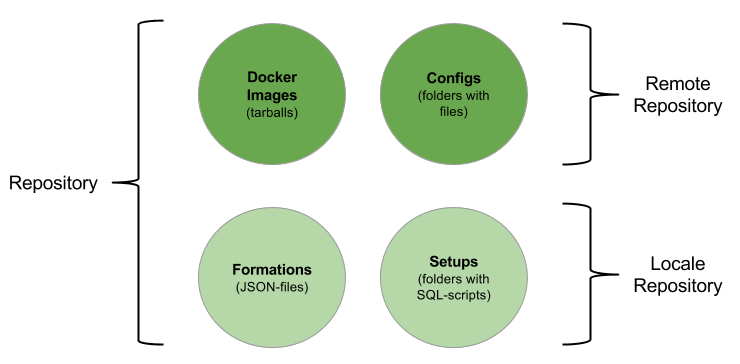
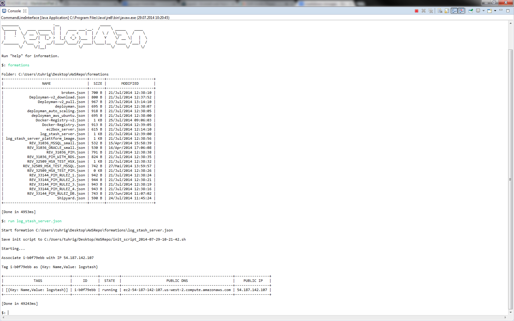
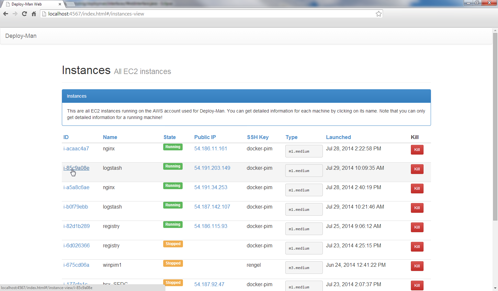
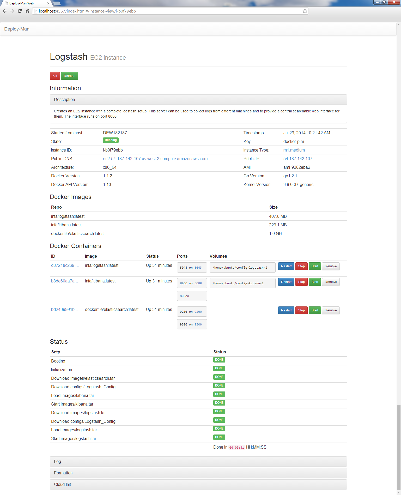

# DeployMan

DeployMan is a command line tool to deploy [Docker images](https://www.docker.com) to [Amazon Web Services](http://aws.amazon.com).

**Note:** DeployMan is an experimental prototyp created for my master thesis about *porting an enterprise OSGi application to a PaaS*. It is not production-ready and was used for academic reasearch solomly. However, sharing what I did will maybe help others and shoult be the purpose of all academic work. Enjoy.

For more information visit [www.tuhrig.de](www.tuhrig.de).

## Features

- A command line interface to start new Docker stacks on EC2 instances.
- A web interface to monitore the deployment process.

## Build and run

To build DeployMan you need **Java 8** and **Maven**. DeployMan was developed in Eclipse (which is optional).

Build DeployMan by running the following command in the root folder of the project:

    mvn clean compile package

This will create two JAR-files with all Java dependencies as well as a couple of external folders and files used by Deploy-Man (e.g. static files served by the web interface that are not included in the JAR file). one JAR-file is for the command line interface (CLI), the other JAR-file is for the web interface. 

Run the command line interface (an interactive shell) by:

    java -jar Deploy-Man-Cli.jar

Run the web interface  on [http://localhost:4567](http://localhost:4567) by:

	java -jar Deploy-Man-Web.jar

After Deploy-Man was build successfully, you can use Docker to build an image of DeployMan's web interface:

    docker build -t tuhrig/deployman .

## Usage (with an easy example)

**Prerequisite:** An Amazon Web Services account.

DeployMan can deploy Docker images to Amazon Web Services. Therefore, you need a Docker image to deploy and an AWS account (there are free accounts, too) to test DeployMan. DeployMan can run on Windows and Linux.

### 1. Configure

DeployMan needs some configuration, e.g. your AWS access key and secrete key. In root folder of the project you will find a file called `config_template.properties` which you need to fill with your settings. It should look like this:

    accessKey = XXXX
    secretKey = YYYY
    aws.region = us-west-2
    ssh.key = C:/Users/tuhrig/Desktop/docker-key.pem
    ec2.instance.key = docker-key
    repo.locale = C:/Users/tuhrig/Desktop/AWSRepo
    repo.bucket = docker-images
    repo.profile = docker-profile
    repo.role = docker-image

**Note** that the S3 bucket, the EC2 profile, the EC2 role and the SSH key must exist!

Now run the command line interface:
 
    java -jar Deploy-Man-Cli.jar

And configure DeployMan:

    config /path/to/your/config/file.properties

### 2. Setup your repository

DeployMan organizes it files in a repository, which is a folder on your local disc as well as on S3. Those files are:

- Docker images stored as tarballs (you can also use a Docker registry) 
- Configurations for images stored as plain folder is arbitrary files
- Formations which are JSON files describing a stack of images to deploy
- Setups for databases which has an ANT build script (this is very specific for my personal use case)

Images and configurations are stored on S3. Formations and setups are stored locally. 

To initialize a fresh repository, run the command line interface: 

    java -jar Deploy-Man-Cli.jar

And run:

    init

Now you have the basic folder structure to use DeployMan. The local folders should look like this:

    DEPLOYMAN_FOLDER/
    |------------- configs/
    |------------- formations/
    |------------- images/
    |------------- setups/

The folders in your S3 bucket should look like this:

    DEPLOYMAN_BUCKET/
    |------------- configs/
    |------------- images/

### 3. Create a formation

A formation is a plain JSON file which describes Docker images to deployed. In order to deploy Docker images to AWS, you need to create a formation which describes those images. 

Here is an exmaple which deploys a Nginx image from the official Docker registry to serve an HTML page:

    {
    	"name": "Nginx",
    	"description": "A Nginx server with a static HTML page.",
    
    	"machine": {
    
    		"name": "nginx",
    		"instance_type": "m1.medium",
    		"security_group": "launch-wizard-1",
    		"image_id": "ami-9282eba2",
            "auto_sync": "false",
    
    		"containers": [
    
    			{
    				"name": "Nginx",
    				"image": "dockerfile/nginx",
    				"config": "configs/UI-Nginx",
    				"command": "docker run -d -p 80:80 -v {{config.folder}}/static:/var/www/static -v {{config.folder}}/config:/etc/nginx/sites-enabled dockerfile/nginx"
    			}
    		]
    	}
    }

To run this formation file, save it in on your local disc in the folder `DEPLOYMAN_REPO/formations` (see the step before).

When you run the command line interface, you can see all available formations by:

    formations

### 4. Configs

For every deployed image, a configuration folder will be deployed, too. Even if the image doesn't need any configuration, an empty folder will be copied to the machine. The actual image and its configuration will always be separated.

In order to run the example from above, we need to create two configurations: a folder called `UI-Nginx` (with settings for Nginx) and a folder called `Empty_Config` (which will be empty). We can create those folders on your local disc and sync them with AWS. Your (local) repository (see step 2) should look like this:

    DEPLOYMAN_REPO/
    |------------- configs/
    |              |------------- UI-Nginx/
    |                             |------------- config/
    |                             |              |------------- nginx.conf
    |                             |------------- static/
    |                                            |------------- index.html
    |------------- formations/
    |              |------------- nginx.json
    |------------- images/
    |              |------------- (empty)
    |------------- setups/
                   |------------- (empty)

The file `nginx.conf` (in the folder `config`) looks like:

	server {
	  root /var/www/static;
	  listen 80;
	  location / {
	    index index.html;
	  }
	}

The file `index.html` (in the folder `static`) looks like (well, what ever you like acutally):

    <h1>Hi!</h1>

To upload this configuration, run the command line interface and execute:

    sync configs

### 5. Deploy

The last step is to run the formation file and to deploy the Docker images to a fresh and new EC2 instance. Run the command line interface and exectue the following:

    run nginx.json

### 6. Check the status

You can monitor the status of the deployment. Open the command line interface and run:

    health <INSTANCE ID>

If all steps are `DONE` your machine is ready. Now you can go to the andress of the machine in your browser to see the running Nginx and static HTML page.

## General workflow

1. Create a Docker image on your local machine.
2. Test the image to verify it is working as expected.
3. Upload the image to a Docker registry (the official registry *or* a private one) or save the tested image as a tarball (with `docker save <image name> > tarball.tar`) and upload it to S3.
4. Create and upload your configurations to S3.
5. Create a formation file which describes the image, configuration and machine that should be deployed.
6. Start the formation with `run your-formation.json`.

## Formations

Formations describe applications stacks to deploy. The containe the Docker images as well as their configuration and the according Amazon EC2 instance. The can be executed by DeployMan and will setup the exact same stack on every run - the are repeatable!

Here is an example of a more sophisticated formation file to setup a Logstash instance. Note that some of the images are downloaded as tarballs while others are pulled from a registry.

After the formation file was run, we have an EC2 instance on IP `11.22.33.44` with Logstash, Kibana and Elasticsearch running together.

	{
		"name": "Logstash server",
		"description": "Creates an EC2 instance with a complete logstash setup. This server
		can be used to collect logs from different machines and to provide a central searchable
		web interface for them. The interface runs on port 8080.",
		"machine": {
	
			"name": "logstash",
			"elastic_ip": "11.22.33.44",
			"instance_type": "m1.medium",
			"security_group": "launch-wizard-1",
			"auto_sync": "false",

			"image_id": "ami-4d41397d",
			"install_docker": "false",
			"install_awscli": "false",
			"open_docker": "true",
			
			"containers": [

				{
					"credential": {
	
						"email": "xxx@yyy.com",
						"password": "123456",
						"name": "xxx",
						"server": "https://index.docker.io/v1/"
					},
					"name": "Elastic Search",
					"image": "dockerfile/elasticsearch",
					"config": "configs/Logstash_Config",
					"command": "docker run -d -p 9200:9200 -p 9300:9300 dockerfile/elasticsearch"
				},
				{
					"name": "Kibana",
					"tarball": "images/kibana.tar",
					"config": "configs/Logstash_Config",
					"command": "docker run -d -p 8080:8080 -v {{config.folder}}:/config:rw infa/kibana"
				},
				{
					"name": "Logstash",
					"tarball": "images/logstash.tar",
					"config": "configs/Logstash_Config",
					"command": "docker run -d -p 5043:5043 -v {{config.folder}}:/config:rw infa/logstash"
				}
			]
		}
	}

## Variables 

DeployMan supports a set of variables inside formation files and its internal Bash scripts (see development section). Those variables can be referenced by `{{variable}}` and will be replaced with their according values during runtime. Some variables are created dynamically during the execution of a formation (e.g. the path of the configuration folder in `config.folder`). Others are static, like the SSH key (`ec2.instance.key`) specified in the configuration of DeployMan. The variables will also be available in ANT-scripts started by a formation.

All available variables:

    ==========================================
    Created dynamically
    ==========================================
 
    tarball.key
    |--> full path of the tarball, e.g. images/elasticsearch.tar
    
    tarball.name
    |--> file name of the tarball, e.g. elasticsearch.tar

    image.name 
    |--> name of the image, e.g. dockerfile/nginx
    
    config.key
    |--> full qualified key of the config, e.g. configs/UI-Nginx

    config.folder
    |--> path of the config folder, e.g. /home/ubuntu/config--0
    
    home.directory
    |--> home directory on the Linux machine, e.g. /home/ubuntu
    
    info.timestamp
    |--> timestamp when the script was send, e.g. 2014-07-29-10-11-09

    info.host
    |--> host which started the machine, e.g. DEW182187

    info.formation
    |--> the JSON of the started formation, e.g. {....}

    info.containers
    |--> number of deployed containers, e.g. 3

    log.deployment
    |--> location of the logfile of the deployment, e.g. /home/ubuntu/deployman.log

    log.docker
    |--> location of the logfile of docker, e.g. /home/ubuntu/docker.log

    ant.file
    |--> 

    dest.root.local
    |-->

    db.default.server
    |--> 

    db.default.port
    |--> A port, e.g. 1501

    db.default.user
    |--> A user, e.g. Joe

    db.default.password
    |--> A password, e.g. 123456

    env.NLS_LANG
    |--> 

    headless
    |--> true or false

    ==========================================
    From the configuration
    ==========================================

    accessKey
    |--> the AWS access key, e.g. XXXXX

    secretKey = YYYY
    |--> the AWS secret key, e.g. XXXXX

    aws.region
    |--> the AWS region, e.g. us-west-2

    ssh.key
    |--> the local SSH key, e.g. C:/Users/tuhrig/Desktop/docker-key.pem

    ec2.instance.key
    |--> the name of the SSH key on AWS, e.g. docker-key

    repo.locale
    |--> the path of the local repository, e.g. C:/Users/tuhrig/Desktop/AWSRepo

    repo.bucket
    |--> Name of the S3 bucket, e.g. docker-images

    repo.profile
    |--> Name of the security profil, e.g. docker-profile

    repo.role
    |--> Name of the security role, e.g. docker-image

# Development

## Cloud-Init and bash scripts

Deploy-Man initializes EC2 cloud instances with Cloud-Init. Cloud-Init is an Ubuntu tool used to create cloud instaces. It supports an own declarative syntax as well as bash or Python. Deploy-Man uses bash.

All bash scripts used in Deploy-Man are located in the folder `scripts` in this project. They can be used via the `CloudInitScript` class. This class is used to build a custom init script based on the scripts in the `script` folder. `CloudInitScript` can append variouse scripts (e.g. it can append copy instructions for multiple containers) and it can replace some variables. 

All variables are written between double curly braces - `{{VARIABLE_NAME}}``. Here is an example:

    aws s3 cp --quiet --region {{aws.region}} s3://{{repo.bucket}}/{{image.key}} {{home.directory}}

If this script is loaded with `CloudInitScript` the variables (`{{aws.region}}`, `{{repo.bucket}}` and so on) will be replaced by the appropriate values. Some values are taken from the Deploy-Man configuration file, others from the formation file and others are created dynamically.

# Screenshots

> The command line interface showing formations and output after starting a Logstash node. You can see the IP and DNS name of the running instance.

> The web interface showing an overview of all running machines on AWS. This is the same what you can see when you log-in to the Amazon Web Console.

> The web interface showing a detailed view for the Logstash node. You can see details to the machine as well as all deployed Docker images and running containers.

# License

## Simplified BSD License

[http://opensource.org/licenses/bsd-license.php](http://opensource.org/licenses/bsd-license.php)

Copyright (c) 2014, Thomas Uhrig
All rights reserved.

Redistribution and use in source and binary forms, with or without 
modification, are permitted provided that the following conditions are met:

Redistributions of source code must retain the above copyright notice, 
this list of conditions and the following disclaimer.
Redistributions in binary form must reproduce the above copyright notice, 
this list of conditions and the following disclaimer in the documentation 
and/or other materials provided with the distribution.

THIS SOFTWARE IS PROVIDED BY THE COPYRIGHT HOLDERS AND CONTRIBUTORS "AS IS" 
AND ANY EXPRESS OR IMPLIED WARRANTIES, INCLUDING, BUT NOT LIMITED TO, THE 
IMPLIED WARRANTIES OF MERCHANTABILITY AND FITNESS FOR A PARTICULAR PURPOSE 
ARE DISCLAIMED. IN NO EVENT SHALL THE COPYRIGHT HOLDER OR CONTRIBUTORS BE 
LIABLE FOR ANY DIRECT, INDIRECT, INCIDENTAL, SPECIAL, EXEMPLARY, OR 
CONSEQUENTIAL DAMAGES (INCLUDING, BUT NOT LIMITED TO, PROCUREMENT OF SUBSTITUTE 
GOODS OR SERVICES; LOSS OF USE, DATA, OR PROFITS; OR BUSINESS INTERRUPTION) 
HOWEVER CAUSED AND ON ANY THEORY OF LIABILITY, WHETHER IN CONTRACT, STRICT LIABILITY, 
OR TORT (INCLUDING NEGLIGENCE OR OTHERWISE) ARISING IN ANY WAY OUT OF THE USE OF 
THIS SOFTWARE, EVEN IF ADVISED OF THE POSSIBILITY OF SUCH DAMAGE.